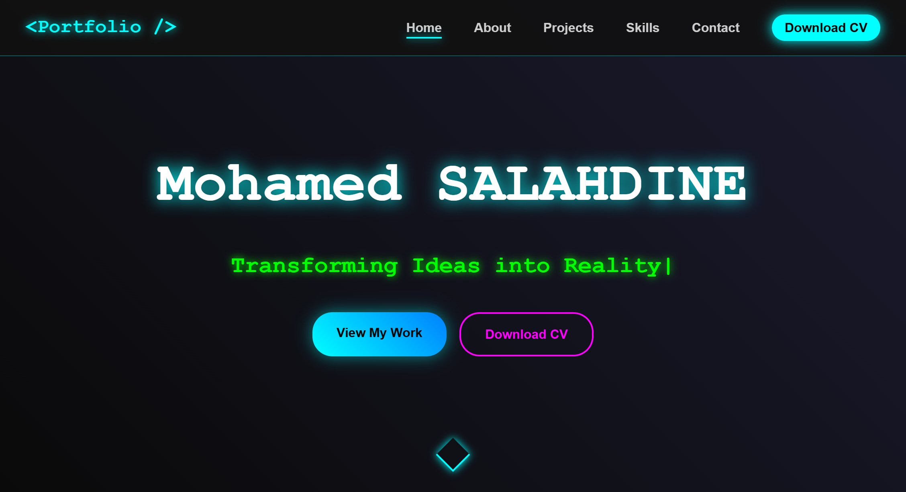

# Personal Portfolio - React & Vite Edition

[](https://app.netlify.com/projects/salahmed/deploys)

A dynamic, fully responsive personal portfolio built from the ground up with React and Vite, featuring a futuristic neon aesthetic and a modular, component-based architecture.

 
<!-- **Action:** Take a screenshot of your site, name it "screenshot.png", and place it in your /public folder -->

---

## 🚀 Live Demo

**Check out the live version:** [**salahmed.netlify.app**](https://salahmed.netlify.app/)
<!-- **Action:** Replace this link with your actual Netlify URL -->

---

## ✨ Key Features

-   🧩 **Modular Architecture:** Built with reusable React components and scoped styling using **CSS Modules** to prevent conflicts and improve maintainability.
-   📱 **Fully Responsive Design:** Ensures a seamless and visually consistent experience on all devices, from mobile phones to desktops.
-   🚀 **Performance Optimized:** Implements **lazy loading** for components "below the fold" to ensure a fast initial page load and an efficient user experience.
-   ✨ **Interactive UI:** Features include a dynamic typing effect, a pop-up modal for project details, smooth scrolling, and a "Back to Top" button.
-   🔄 **CI/CD Pipeline:** Deployed on **Netlify** with a Continuous Integration/Continuous Deployment pipeline that automatically deploys changes on every `git push` to the main branch.

---

## 🛠️ Tech Stack

This project was built using a modern, professional tech stack:

-   **Frontend:** React, Vite
-   **Styling:** CSS Modules
-   **Deployment:** Netlify


---

## 🔧 Getting Started

To run this project locally, follow these steps:

1.  **Clone the repository:**
    ```bash
    git clone https://github.com/salahmed1/react-portfolio.git
    ```
    <!-- **Action:** Make sure this URL is your correct repository URL -->

2.  **Navigate to the project directory:**
    ```bash
    cd react-portfolio
    ```

3.  **Install the dependencies:**
    ```bash
    npm install
    ```

4.  **Start the development server:**
    ```bash
    npm run dev
    ```
    The application will be available at `http://localhost:5173`.

---

## 🏗️ Architectural Decisions

This project was intentionally migrated from a vanilla JavaScript codebase to a modern React architecture to showcase best practices in frontend development.

-   **Component Modularity:** The application is broken down into small, single-responsibility components (e.g., `Hero`, `Timeline`, `Modal`), making the codebase easier to reason about and scale.
-   **Scoped Styling:** CSS Modules were chosen over a single global stylesheet to prevent class name collisions and to co-locate component styles with their logic. This ensures that a change in one component's style cannot accidentally break another.
-   **Custom Hooks:** Logic for UI state, such as scroll visibility (`useScrollVisibility`), was extracted into custom hooks to keep components clean and the logic reusable (DRY - Don't Repeat Yourself).

---

## 📜 License

This project is licensed under the MIT License. See the [LICENSE](LICENSE) file for details.
